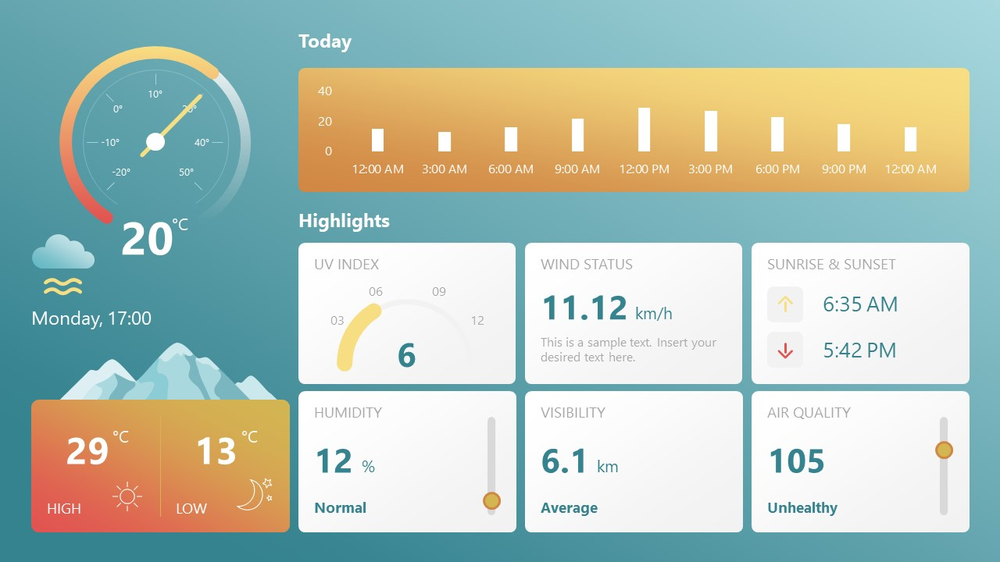

#Aplicacion Clima & Transporte. :sunny:  :umbrella:  :cloud:

##Se siguió el diseño sugerido. :snowflake:

:partly_sunny: El proyecto contiene dos app, una de clima y de trasporte publico (colectivos).
Ambas traen los datos de APIs publicas, la de trasporte especialmente solo de Buenos Aires Capital.

:waxing_gibbous_moon: Se comenzó dandole forma estatica y harcodeando los datos y luego se introdujo la llamada a APIs, 
utilizando fetch.

:iphone: Trabajé mucho la visibilidad móvil y comence a jugar con "agregar a la pantalla principal" en dispostivos
movil como una PWA a muy grandes rasgos.

:oncoming_bus: En una ultima estapa comenzamos a mejorar las apps. De ahi la lista de ideas que genere debajo
y luego fui trabajando. La idea es terminarlas por completo en lo posible. 

:bulb: Ideas para ir mejorando la app: 

- Calculo de punto medio entre los micros para cambiar la piscion del mapa, el codigo está.
- Poner un filtro de brillo, mientras mas de noche mas oscuro. 
- Current Location
- Boton para descargar la app (PWA)
 - Que se vean mas dias del clima (Queda para otra version (?))
 
 :bulb: Realizadas: 

 - Boton actualizar transporte no se ve en movil. LISTOO
 - Pasar el codigo de Grafico a otro archivo e importarlo, crear un objeto. 
 - MEJORAR EL GRAFICO  
 - Utilizar reactRouter para intercambiar entre clima y transporte en dispositivos moviles aprovechando
   el width de la pantalla, con un boton. 
 - Arreglar el responsive 
 - Select de ciudad. 

:heavy_exclamation_mark::heavy_exclamation_mark:Los componentes Today y BarraDay fueron reemplazados por recharts. 

###Imagen de fondo de AppClima
 <a href="https://www.freepik.es/foto-gratis/cielo-colorido-nubes-palabras-nublan_40792565.htm#query=svg&position=5&from_view=keyword&track=sph">Imagen de Sketchepedia</a> en Freepik